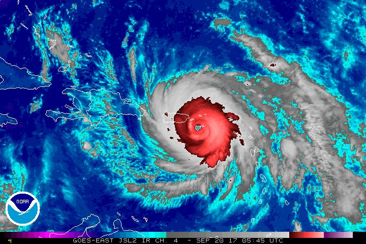

# EY Data Challenge 2024: Storm Damage Assessment

## Objective
The goal of the challenge is to develop a machine learning model to identify and detect “damaged” and “un-damaged” coastal infrastructure (residential and commercial buildings) impacted by natural calamities such as hurricanes, cyclones, etc. You are provided with pre- and post-cyclone satellite images of a site impacted by Hurricane Maria in 2017 and are tasked with building a machine learning model capable of detecting four different objects in a satellite image of a cyclone-impacted area:
- Undamaged residential building
- Damaged residential building
- Undamaged commercial building
- Damaged commercial building

## Dataset Used
### Mandatory Dataset:
- High-resolution panchromatic satellite images before and after a tropical cyclone: Maxar GeoEye-1 (optical)

### Optional Datasets:
- Moderate-resolution satellite data: Sentinel-2 (optical), Sentinel-1 (radar)

## Skills Required
- Computer vision and Python programming.
- Machine learning, and handling large satellite images.
- Knowledge of GIS, ARCGIS
- Knowledge of satellite imagery, coastal infrastructure, and damage assessment.

## Infrastructure Requirement
- Compute resource: 4 core 32 GB memory
- Development language: Python (notebook format)
- Development environment: Microsoft's Planetary Computer's Hub environment (recommended), Microsoft Azure, or any other cloud-based environment.

  I used google colab's T4 GPU for ML/AI, and Microsoft Planetary Computer for creating tiles.

## What Participants Are Expected to Do
- Develop a machine learning model based on provided pre- and post-cyclone satellite images.
- Detect objects on validation images using the developed model.
- Save detection results (class, confidence score, bounding box coordinates) in a .txt file for each validation image.
- Upload all .txt files in a single .zip file to the challenge platform for scoring and ranking.

## Data Description
### Mandatory Dataset:
- Pre-Event Image: Maxar GeoEye-1 satellite image taken on 29th Aug’17.
- Post-Event Image: Maxar GeoEye-1 satellite image taken on 12th Oct’17.
- Location: US territory of Puerto Rico, affected by Hurricane Maria in 2017.

### Optional Datasets:
- Moderate-resolution satellite datasets like Landsat, Sentinel-2, etc., available from Microsoft Planetary Computers Catalog.
- Building footprint data over the region of interest.

## Conclusion
The EY Data Challenge 2024 on Storm Damage Assessment provides participants with an opportunity to leverage computer vision and machine learning techniques to address critical issues related to natural disaster response and infrastructure damage assessment. By participating in this challenge, individuals can hone their skills, explore innovative approaches, and contribute to building solutions with real-world impact. 

With the code in the provided notebooks I was able to model the top performing computer vision model in Kenya and Africa. 

[EY Certificate](https://www.linkedin.com/posts/emmanuel-rono-478875104_computervision-yolov9-activity-7173292425568763906-Kguv?utm_source=share&utm_medium=member_desktop)

## Contributor

- [Emmanuel Rono](https://github.com/marttech26)
